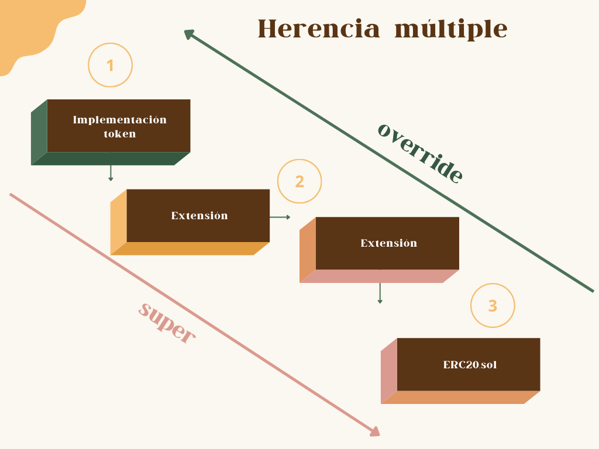

# Tokens ERC20 #

## ¿Qué es un token? ##

Un token es un tipo de contrato inteligente cuyo propósito es la creación de medios de intercambio no distingibles entre sí y que estén dotados de una transmisibilidad, pudiendo ser representativos de activos virtuales o físicos, así como incorporar mecanismos que le otorguen determinadas funcionalidades por medio de algoritmos, especialmente en lo relativo a su emisión y suministro.

En el día a día se suelen confundir con las criptomonedas, por lo que en ocasiones hay quienes suelen usar ambos términos indistintamente, no obstante, dado que este es un proyecto de contratos inteligentes es necesario distinguir y entender cual es la diferencia.

Recordemos que la tecnología que habilita a los contratos inteligentes es Blockchain. Esta tecnología, en términos generales, va a tener los siguientes componentes:
- La cadena de bloques (esta es la esencia).
- Un mecanismo de consenso.
- Una máquina virtual.
- Una criptomoneda nativa.

Si tuviera que simplificar como interactuan estos componentes lo haría en respuesta a una pregunta:

- ¿Cómo resuelve una blockchain el problema de transmitir valor entre las partes?
- R: Blockchain X crea un registro digital para efecto de mantener un control de todas las trasacciones que se den entre las partes usando una criptomoneda nativa. Este registro se materializa en la forma de un bloque de información (como monto, fecha, propietario, destinatario, etc), que se concatena con la siguiente transacción, creando así un historial que denominamos como cadena de bloques. Esta cadena se ve dotada de seguridad cuando definimos cómo nos aseguramos de la veracidad de la información y la forma en que se incorpora a la cadena, por lo que existen distintos algoritmos que podemos usar para efecto de resolver estas cuestiones, al ser el componente que sustenta la integridad de una blockchain, se le denomina como mecanismo de consenso. Finalmente, se incorpora un elemento adicional a algunas blockchains que les da la posibilidad de tener contratos inteligentes y este es una máquina virtual. La idea es que al bloque le agregamos una pieza más de información, que en este caso va a ser código (nuestros contratos inteligentes), usamos a las computadoras que ya están verificando las transacciones e integrandolas en la cadena usando el mecanismo de consenso correspondiente y adicionalmente les pedimos que ejecuten el código que enviamos, siendo indispensable para esto que incorporen una computadora virtual, que nos garantice que el resultado de la ejecucción del código sea igual.

Estoy muy consciente de que faltan muchos elementos que discutir en esta pequeña definición, pero lo que me interesa que distingamos es porqué podemos tener una criptomoneda nativa y a su vez una gran variedad de tokens que coexistan en una misma blockchain. Esto es sencillo de entender una vez que separamos el elemento de los contratos inteligentes de las transacciones que se dan con la criptomoneda.

A su vez, quisiera dejar algo sumamente claro, especialmente para otros abogados. Me parece que los tokens son muy intuitivos para nosotros porque las transacciones con valor económico son parte esencial de la vida contractual, lo mismo ocurre cuando las usamos para representar toda clase de activos como materias primas o incluso las acciones de una sociedad. No obstante hay que ser muy cuidadosos al discutir este tipo de contratos inteligentes en foros o al pensar en la regulación que deben tener, porque no hay límite desde la óptica de los desarrolladores en cuanto a la función que quieran darle a sus tokens. Para clarificar este punto pensemos en que puede haber un token diseñado para representar las fichas de un casino digital, o un token representativo de un boleto de loteria o rifa, o uno para los programas de recompensas aparejados a las tarjetas de crédito, o para representar el progreso de un personaje en un videojuego. Notese como cada una de estas funciones tiene en principio una óptica y regulación completamente distintas, en el caso del casino y la rifa inmediatamente señalaría a la regulación de los juegos y sorteos, mientras que en lo relativo a programas de recompensas de las tarjetas de crédito prodriamos señalar la materia de derecho bancario o para el caso de que el token mismo fuera representativo de una emisión de deuda, la materia de títulos y operaciones de crédito. Lo que podemos observar es que el token en sí mismo es todo y nada, siempre tendremos que estar al caso concreto en cuanto a la función que tenga, y como vimos en el caso del videojuego, también podrían ser usado para fines completamente técnicos sin mayor relevancia jurídica.

## ¿En qué consiste el estandar ERC20? ##

Primero tenemos que entender qué es una EIP (Ethereum Improvement Proposal), para esto debemos de tener claro que Ethereum es completamente de código abrierto, cualquiera puede revisarlo, utilizarlo o modificarlo. Debido a esto se decidió establecer lineamientos para efecto de que cualquier desarrollador pudiera proponer modificaciones, mejoras o incluso innovaciones. Existen distintos tipos de EIPs, siendo uno de ellos las ERC (Ethereum request for comment), las cuales se enfocan en proponer estándares para las aplicaciones y contratos con la finalidad de promover interoperabilidad dentro del ecosistema. 

Una vez aclarado el punto anterior, es sencillo comprender que ERC20 (la numeración los identifica) se trata de una propuesta de estandar para los tokens, la cual está disponible para consulta en https://eips.ethereum.org/EIPS/eip-20.

El estandar nos pide que tengamos ciertas funciones y que tengan un comportamiento, requisitos y resultado determinados.

## Estructura de un token ERC20 ##

En cuanto a las funciones que nos pide el estandar podríamos dividirlas en funciones informativas, que alteran estado y eventos. En la siguiente imagen podemos ver exactamente los nombres que deben tener de acuerdo al estandar ERC20, así como la categoría en la que se encuentran.


## Funcionamiento ##

Este contrato permite:
- Transferir tokens a cualquier cartera u otros contratos.
- Aprobar a otras carteras o contratos para que utilicen el balance de un usuario.
- Emitir tokens a una cartera o contrato determinado.
- Destruir tokens de una cartera o contrato determinado.

Características:
- Se puede emitir practicamente una cantidad ilimitada de tokens (el límite sería 2²⁵⁶-1).
- No hay restricción en cuanto al monto que puede ser transferido o aprobado para efecto de que otra dirección lo utilice.
- Quien haya sido aprobado puede disponer de fondos ajenos como si fueran suyos.
- No tiene contruida ningún mecanismo que accione la emisión ni la destrucción de tokens, por lo que estas deberán ser programados para efecto de usar los mecanismos internos del contrato o en su caso modificarlos.
- Cuenta con dos funciones adicionales que son `increaseApproval` y `decreaseApproval`, estas no forman parte del estandar pero son incluidas en la implementación de OpenZeppelin para mitigar problemas asociados a la función `approve`.

Habiendo entendido lo anterior, podemos empezar a explicar conceptualmente el funcionamiento del token. Toda la funcionalidad del token gira en torno a dos registros, los balances y las aprobaciones, por lo tanto siempre hay que tener en mente que alguna de estos dos registros van a ser alterados cuando usamos las funciones del contrato. A su vez, la modificación de dichos registros actualiza los valores que contienen, por lo que las funciones informativas únicamente nos muestran los nuevos valores o en su caso aquellos que les dimos desde el comienzo.

En la siguiente imagen se puede observar un diagrama con el funcionamiento, nota como primero hay una fase (de un color azul oscuro) que precede a todo, llamada contructor, junto con las declaración de variables, esta sección va a existir por el mero despliegue del contrato. En esta fase indicamos la información que va a contener el contrato así como la asignación de dos de estos valores, el nombre y símbolo, los cuales son inmutables. Posteriormente encontramos las tres categorías que ya se mencionaban anteriormente.

Hay que notar la distinción que se hace en lo referente a las funciones informativas al estar algunas asignadas desde el contructor, mientras que otras solo proveen información que es actualizada a partir de la activación de dos funciones internas, `_approve` y `_transfer`. Estas últimas son el núcleo del contrato, tienen un `_` al comienzo para indicar que son funciones internas, lo que significa que nadie puede accesarlas o modificarlas directamente sino que solo pueden ser activadas a través de otras funciones que hayamos designado para este propósito. Las funciones que activan a las internas son aquellas que las preceden en el diagrama, estas son las que el usuario va a llamar para interactuar con el contrato, aquellas a las que deberas asignarles botones en la interfaz que dedcidas construir.

Los hooks así como las funciones internas `_mint` y `_burn`, no están conectadas directamente en el diagrama a nada, la razón de esto es justamente que no tienen absolutamente ninguna funcionalidad en el modelo básico de un token, sino que aquí es donde un desarrollador puede implementar cualquier mecanismo que desee para hacer a este token único o funcional. En la siguiente sección vamos a hacer la implementación real de un token con distintos mecanismo de emisión que si ocupen dichas funciones, asi mismo hay una sección más adelante dedicada al uso de los hooks.

Quiero recalcar la necesidad de consultar el archivo [ERC20.sol](Base/tokens/ERC20/ERC20.sol), dado que este contiene el código con mis comentarios en cada una de sus líneas para entender exactamente como se dan estos procesos, por supuesto que mis recomendación sería tener el diagrama que diseñe ya que te servira para siempre entender las relaciones que se están formando.


## Mecanismos de emisión ##

Existen básicamente tres formas de emitir el token:

1. Suministro predefinido: En este caso lo que se hace es emitir al momento de la creación del contrato a una dirección predefinida (generalmente aquella que despliega el contrato).
	
	Ejemplo:
	```solidity
	pragma solidity ^0.8.4;

	import "@openzeppelin/contracts/token/ERC20/ERC20.sol";

	contract MiToken is ERC20 {
		constructor() ERC20("MiPrimerToken", "MPTK") {
			_mint(msg.sender, 1000 * 10 ** decimals());
		}
	}
	```

	Felicitaciones, con este código puedes crear tu token ERC20, solo debes modificar el nombre y símbolo (en este caso "MiPrimerToken" y "MPTK"), así como la cantidad que será emitida (en este caso son 1000 tokens).
	Esta es la forma más básica de un token, todo lo que hemos analizado hasta ahora del contrato ERC20 es automaticamente trasladado a esta pequeña implementación tan solo con importar el estandar e indicar que hereda sus métodos con la declaración 'contract MiToken is ERC20'. Debo recalcar que lo que esto ocasiona es una emisión única, en la que quien despliegue el contrato automáticamnete tendrá todo el suminsitro y sin posibilidad de emitir tokens adicionales. 

2. Implementar una función de emisión: Basicamente vamos a contruir esa función faltante para efecto de utilizar `_mint`.

	Ejemplo:
	```solidity
	pragma solidity^0.8.0;

	import "@openzeppelin/contracts/token/ERC20/ERC20.sol";
	import "@openzeppelin/contracts/access/Ownable.sol";
	
	contract MiToken is ERC20, Ownable {
		constructor() ERC20("MiPrimerToken", "MPTK") {}

		function mint(address to, uint256 amount) public onlyOwner {
			_mint(to, amount);
		}
	}
	```
	Este mecanismo es distinto al anterior dado que comenzaría el token teniendo 0 en circulación y solamente el propietario podría decidir a quien emite tokens, lo que iría aumentando el límite progresivamente. Hay en este caso una nueva importación de un contrato llamado `Ownable.sol`, este es una extensión que agrega la posibilidad de limitar funciones para que solo puedan ser llamadas por la dirección que desplegó el contrato, en la sección de extensiones explico a profundidad como funciona esta y otras disponibles.

3. Modularizar el mecanismo de emisión: Esta opción es una tanto más complicada, consiste en separar el mecanismo de emisión del contrato principal, una forma de lograrlo es a través de una serie de modificaciones al token. Hay que tomar en consideración que para fines prácticos ambos contratos deben estar juntos para efecto de que se pueda crear una instancia del token, pero técnicamente lo que ocurre es que se crean dos contratos distintos.

	Ejemplo:
	```solidity
	contract FondeoProyecto {
		ERC20PresetMinterPauser _token;
		address propietario;

		constructor(ERC20PresetMinterPauser token) public {
			_token = token;
			propietario = msg.sender;
		}

		function emitirParaRecaudar() public {
			require(msg.sender == propietario);
			_token.mint(propietario, 1000);
		}
	}
	```

Debo aclarare que este es una modificación del ejemplo que provee OpenZeppelin para efecto de demostrar la modularización del mecanismo de emisión, solo que originalmente estaba programado de tal forma que emitiera los tokens a quien hubiera minado el último bloque al momento de llamarla. El problema que yo identifico con esa implementación es que me parece que no tiene utilidad alguna, especialmente cuando lo ponemos en contexto, ya que como podrás darte cuenta utiliza una instancia de un contrato llamado `ERC20PresetMinterPauser` que está especialmente adaptado para efecto de crear un protocolo alrededor del token que permita distribuir autorizaciones para efecto de manejar las distintas funciones(emitir, destruir, pausar y reanudar), es decir, que se designe a una dirección para controlar alguna de las funciones. En este caso este contrato es inutil a menos que se le conceda la autorización de emisión, momento a partir del cual cualquiera podría llamarla y empezar a otorgar los tokens a los mineros, solo que no hay límite en cuanto al numero de veces que se podría llamar, lo que podría ocasionar que se devaluara significativamente el token. En realidad entiendo que se trata de un ejemplo y que no hay la finalidad de pensar en las implicaciones, sino de demostrar un mecanismo, no obstante me pareció que tenía más sentido modificar el ejemplo para efecto de que se usara como un mecanismo de recaudación de fondos en el que se le concede la posibilidad al creador de emitir tokens cuando requiera financiación, y que dicha emisión tuviera que ser aprobada por quien esté facultado para concederlas, pero sin que esto se tradujera en un riesgo, puesto que como puedes ver fijé un límite en cuanto a la posibilidad de emitir, ya que solo el propietario puede llamarla.


## Hooks ##

Los hooks son funciones para la implementación de mecanismos que tengan lugar en tres eventos: transferir, emitir y destruir tokens. A su vez, hay que distinguir entre `_beforeTokenTransfer` y `_afterTokenTransfer`, ya que una va a funcionar antes de que se de alguno de estos eventos, mientras que la otra antes de que terminen. Para entender como operan necesitamos abordar con mayor profundidad el tema de "multiple inheritance" (hereder de múltiples contratos), ya que esta es la base sobre la que operan los Hooks. Como podrás notar, en el contrato base `ERC20.sol`, ya se encuentran definidas ambas funciones aunque carentes de contenido. Al momento de crear nuestro token, este hereda todos los métodos del contrato base `ERC20.sol`, por lo que la unica forma de dotar de contenido a los hooks es volviendolos a declarar con la indicación de que deberán de ser ejecutados en lugar de aquellos que estan en el contrato base (nuevamente, porque estos no hacen nada), esto se logra con la indicación `override` y ahora es sencillo entender otra de las indicaciones que observarás en muchos otros contratos llamada `virtual`, que es aquella que posibilita que se haga un override. Esta es la razón por la que si deseas que otros desarrolladores puedan modificar las funciones de tu contrato lo deberás pensar desde el inicio, dado que la omisión de `virtual` impedirá dicho comportamiento en el futuro (recordemos el principio de la inmutabilidad del código). A su vez, es importante resaltar que hasta ahí solo estamos reemplazando funcionalidad, pero el objetivo de los hooks es agregar funcionalidad en distintos niveles, por lo que siempre tendremos que llamar a la función que estamos reemplazando para efecto de que no se omita el coportamiento programado en esta. La forma de lograr esto es con la indicación `super`, que llamará a la función que fue reemplazada.

La forma en la que operarán será analógica a estar posicionado en la cima de una torre, el nivel más alto de la torre representa la última funcionalidad programada, y conforme se descienda de nivel iremos ejecutando las funcionalidades programadas en otros contratos de los que hereda, hasta llegar al más básico de todos que es `ERC20.sol`(sería el fundamento de la torre).

En la siguiente imagen quise ilustrar como se vería esta herencia múltiple aplicada a los hooks. Los números representan el orden de ejecucción, la flecha de `override` demuestra como indicamos que el orden y as u vez, la flecha de `super`, indica el mecanismo para que se ejecuten todos los niveles anteriores. Como podrás ver, incluí en un nivel intermedio a las extensiones, esto lo explico en el siguiente apartado, pero la idea es que muchas de las funcionalidades que podrías llegar a querer implementar son comunes y por lo tanto ya han sido programadas, por lo que son buenas noticias para quien las quiera incorporar. Sin embargo, las extensiones no excluyen la posibilidad de seguir implementando funcionalidades adicionales, por esta razón es tan relevante entender el órden en que se está heredando.



Por último, quiero destacar que hay dos requisitos para el uso de hooks:
1. Hacerlos con la indicación `virtual` (para que se pueda seguir agregando funcionalidad).
2. SIEMPRE llamar al hook anterior con `super`, ya sea `super._beforeTokenTransfer(from, to, amount);` o en su caso `super._afterTokenTransfer(from, to, amount);`.

En el siguiente ejemplo, implemento un hook que va a otorgar por única vez como incentivo 100 tokens a aquellos que acumulen un balance de 1000 tokens. Similar a lo que hacen algunas tarjetas de crédito/débito que otorgan una determinada cantidad a partir de un depósito o gasto por un monto determinado.

```solidity
pragma solidity ^0.8.4;

import "@openzeppelin/contracts@4.7.3/token/ERC20/ERC20.sol";

contract MyToken is ERC20 {
    mapping(address => uint8) private _reg_incentivos;
    
    constructor() ERC20("MiToken", "MTK") {
        _mint(msg.sender, 10000 * 10 ** decimals());
    }
    function _afterTokenTransfer(address from, address to, uint256 amount) 
    internal virtual override 
    {
        if (_reg_incentivos[to] == 0 && balanceOf(from) >= 1000 * 10 ** decimals()) {
            _mint(to, 100 * 10 ** decimals());
            _reg_incentivos[to] = 1;
        }
        super._afterTokenTransfer(from, to, amount);
    }
}
```
Recuerda que el contrato anterior es una implementación completa de un token, con un suministro predefinido de 10000, pero con un mecanismo de incentivo/emisión que otorga 100 tokens a quienes acumulan un balance de 1000. En este caso no tengo que filtrar el comportamiento para que no se aplique a la emisión y destrucción puesto que no tiene dichas funciones programadas, pero si lo quisieras hacer solo debes poner otro filtro adicional en el `if` para que verifique si se usa la dirección cero (si se usa en 'from' es emisión y si se usa en 'to' es destrucción).

## Extensiones ##

Estos son una serie de contratos que al integrarlos con tu token integran funcionalidades adicionales.

- ERC20Burnable.sol: Añade dos funciones al token, una de ellas para que el propietario de los tokens pueda destruirlos `burn` y otra para que otra dirección autorizada sea la que los destruya, `burnfrom`.

- ERC20Capped.sol: Este contrato sirve para definir una cantidad máxima del suministro del token, esto se hace desde la creación y a su vez sustituye el mecanismo de `_mint` para efecto de establecer como requisito que cualquier emisión verifique que no exceda el máximo fijado.

- ERC20Pausable.sol: Se trata de un contrato que utiliza el hook `_beforeTokenTransfer`, para establacer como requisito de emisión, transferencia y destrucción que el contrato no se ecnuentre pausado, aunque la posibilidad de pausar y reanudar, se enceuntra programa en otro contrato llamado `Pausable.sol`.

- ERC20Snapshot.sol: Este contrato se encarga de guardar el estatus de un token en un momento en el tiempo. La razón por la que se querría hacer esto puede ser diversa, un ejemplo podría ser para incentivar y otorgar recompensas a usuarios que adquirieron el token en una etapa temprana o para realizar un "fork" (una nueva versión del token anterior con modificaciones esenciales), al guardar un registro de todos los usuarios anteriores podrías distribuirles el nuevo token conservando exactamente el mismo balance y estado del token anterior. La implementación de este módulo es un poco más compleja por lo que recomeindo consultar mis comentarios sobre su funcionamiento en el código (extensiones/ERC20Snapshot.sol).

- ERC20Votes.sol: Este contrato es muy interesante, pero no va a tener ninguna utilidad como extensión por sí sola, ya que el objetivo es que el token se transforme en un sistema para la cuantificación y control de poder de votación, usando el token como la medida. Es decir, entre más tokens tengas, más poder de votación tendrás. La única forma en la que tendrá sentido esta extención es en conjunto con todo un protocolo, que incorpore la posibilidad de toma de decisiones y governanza, para efecto de que tenga sentido llevar a cabo votaciones y por supuesto, implementar los resultados. Este contrato tiene una función para delegar el poder de voto, para que cualquier otra dirección vote en nombre del delegante, no obstante, también es necesario que el propietario de los tokens se autodelegue para efecto de que quede registrado su poder de voto. Cada vez que se haga una delegación se crea un checkpoint que lleva el control, lo que nos permitirá llevar un control del poder de voto histórico así como consultar el último checkpoint de todos los usuarios con independencia de cuantos hayan hecho. Reitero, aún teniendo un gran balance de tokens, para efecto de este módulo si no hay delegación no hay registro, por lo tanto habría que informar a los usuarios. La única consideración es que usar este mecanismo tendrá que ir aparejado de una limitación del suministro del token, en este caso el máximo podrá ser 2²²⁴-1.

- ERC20VotesComp.sol: Este contrato es sumamente similar, solo que está pensado para adaptarse con el contrato de otro protocolo llamado Compound. La única razón por la cual querrías usar esta extensión sobre la anterior sería si buscaras compatibilidad con el protocolo antes mencionado, de otra forma mi recomendación es usar el anterior, ya que este limita el siministro significativamente a 2⁹⁶-1. En cuanto a su funcionamiento, es identico al anterior, solo cambia el nombre de las funciones informativas, pero a pesar de esto OpenZeppelin incluye las funciones del anterior, por lo que no hay afectación alguna sino redundancia.

- ERC20Wrapper.sol: 

## Aplicaciones en el ámbito jurídico ##

## Experimentos ##

## Demostración de operación ##
